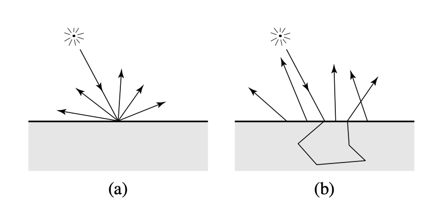

---
---
<link rel="stylesheet" href='../markdown.css'>

April 8, 2019

# Subsurface Scattering (SSS) Proposal

David Wang, Rahul Malayappan, William Gan

## Overview

For this project, we plan to implement various subsurface scattering models to produce realistic-looking images for translucent materials, such as skin. We also want to compare the different models in terms of their image quality, performance, and simplicity.

## Problem

For our pathtracer so far, we have only considered surface level scattering. That is, we have assumed that a light ray hitting a surface is either reflected or refracted. While this is accurate for materials such as metals, many materials exhibit subsurface scattering. What this means is that an incoming light ray may travel under the surface and bounce around many times before coming out at a different point.

In order to realistically render surfaces such as milk, leaves, and marble, it is important that we account for subsurface scattering. However, this is challenging because subsurfacing scattering doesn't follow the standard BRDF model. We need an additional parameter to represent the outgoing point on the surface, and this leads to a function referred to as the Bi-directional Scattering-Surface Reflectance Distribution Function (BSSRDF). Furthermore, there is a complex theory behind how the BSSRDF should act due to the fact that surfaces such as skin have many different layers. And finally, in order to efficiently implement this, there are approximations and tricks which present challenges in themselves.

## Goals

# 

## Schedule

## Resources

### References

1. Kind of the "big" paper on SSS. [Jensen et al. *A practical model for subsurface light transport*](https://dl.acm.org/citation.cfm?id=383319)
2. For multi-layered SSS e.g. skin. [Donner and Jensen. *Light diffusion in multi-layered translucent materials*](https://dl.acm.org/citation.cfm?id=1073308)
3. A slightly different model than [1] that we wish to compare with. [d'Eon and Irving. *A quantized-diffusion model for rendering translucent materials*](https://dl.acm.org/citation.cfm?id=1964951)
4. [PBRT](http://www.pbr-book.org/3ed-2018/contents.html) for reference on SSS in general.
5. [Some random note](http://www.cs.cornell.edu/courses/cs667/2005sp/notes/09wang.pdf) from a Cornell course that might be helpful.
6. [A Wikipedia article](https://en.wikipedia.org/wiki/Radiative_transfer_equation_and_diffusion_theory_for_photon_transport_in_biological_tissue) on radiative transfer and diffusion theory, which are important concepts in SSS.

### Tools

For hardware, two of us have pretty powerful computers that can serve as a baseline. On top of that, we will use the EECS Linux machines. If need be, we can also use free credits to rent time on GCP or AWS, but based on skimming the papers mentioned above, it seems like that won't be necessary.

For software, ideally we can completely implement SSS by extending our Pathtracer code. However, since the BSSRDF may involve more complex abstraction structures, we might base our code off a library like PBRT's. Their library actually implements an SSS of their own, but it is different from ours and we would only use their higher level abstractions. Rather, we could actually compare our results to theirs in the end.